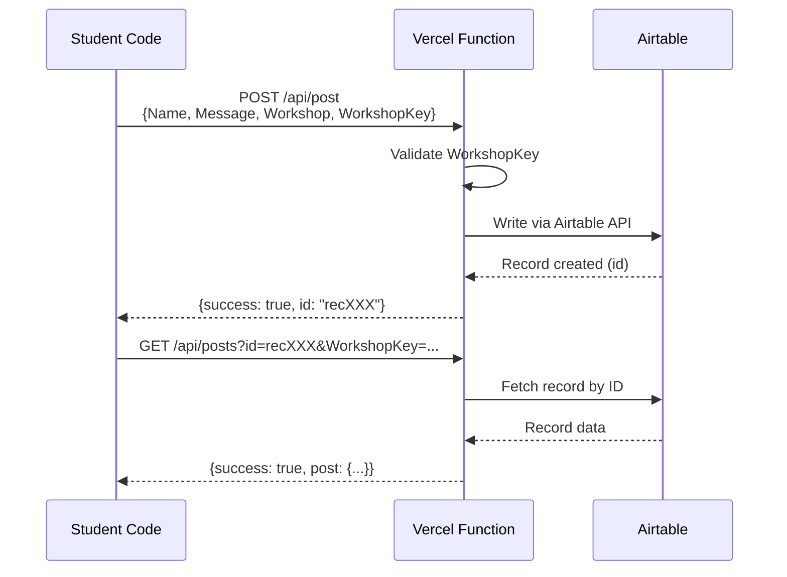

# Workshops Live Feed

A lightweight live feed I use for my workshops. Participants post via code and see results on a shared screen in real-time.

**Live URL:** <https://live.segunakinyemi.com>

## What This Does

1. I give participants the endpoint URL and a `WorkshopKey`
2. They write code (Python, JavaScript, or PowerShell) to POST a message
3. They verify their post exists by calling the GET endpoint with the returned ID
4. Their post appears on the live feed within seconds
5. I display the feed on a projector for everyone to see

## Architecture



- **Vercel** hosts the static site and serverless functions
- **Airtable** stores posts and provides the embedded gallery view
- **WorkshopKey** prevents random internet submissions

## API Endpoints

### POST `/api/post`

Creates a new post.

| Field | Type | Required | Description |
|-------|------|----------|-------------|
| `Name` | string | Yes | Participant's name |
| `Message` | string | Yes | The message content |
| `Workshop` | string | Yes | Workshop name (e.g., "AI Interview Workshop") |
| `Tags` | string | No | Comma-separated tags |
| `WorkshopKey` | string | Yes | Secret password |

**Response:** `{ success: true, message: "Posted successfully!", id: "recXXX" }`

### GET `/api/posts`

Retrieves posts for verification.

**Mode 1: Get specific post by ID**

```txt
GET /api/posts?id=recXXX&WorkshopKey=...
```

**Response:** `{ success: true, post: { id, name, message, workshop, tags, createdAt } }`

**Mode 2: List recent posts by workshop**

```txt
GET /api/posts?workshop=AI%20Interview%20Workshop&WorkshopKey=...
```

**Response:** `{ success: true, count: 12, workshop: "...", posts: [...] }`

**Mode 3: List recent posts by tag**

```txt
GET /api/posts?tag=python&WorkshopKey=...
```

**Response:** `{ success: true, count: 5, tag: "python", posts: [...] }`

## Local Development

1. Fill out an `.env` file with the required values.
2. Run `npx vercel dev`
3. Open http://localhost:3000

## Testing & CI/CD

Integration tests run automatically on every push to `main` via GitHub Actions. Tests run in Python, JavaScript, and PowerShell in parallel, creating posts, verifying they exist, then cleaning up.

See [tools/README.md](tools/README.md) for details on:

- How the CI/CD pipeline works
- Running tests manually
- Required GitHub secrets (`WORKSHOP_KEY`, `ADMIN_KEY`)
- The full test flow (POST → GET → DELETE)
