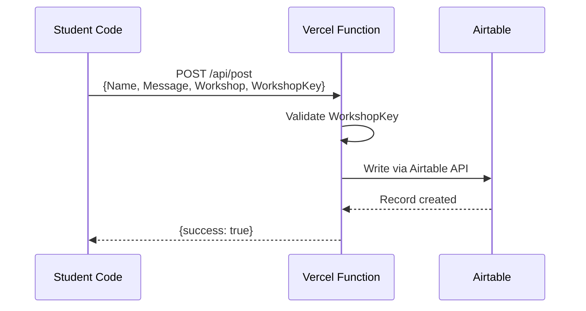

# Workshops Live Feed

A lightweight live feed I use for my workshops. Participants post via code and see results on a shared screen in real-time.

**Live URL:** https://live.segunakinyemi.com

## What This Does

1. I give participants the endpoint URL and a `WorkshopKey`
2. They write code (Python, JavaScript, or PowerShell) to POST a message
3. Their post appears on the live feed within seconds
4. I display the feed on a projector for everyone to see

## Architecture

- **Vercel** hosts the static site and serverless function
- **Airtable** stores posts and provides the embedded gallery view
- **WorkshopKey** prevents random internet submissions

## Required Fields

| Field | Type | Required | Description |
|-------|------|----------|-------------|
| `Name` | string | Yes | Participant's name |
| `Message` | string | Yes | The message content |
| `Workshop` | string | Yes | Workshop name (e.g., "UNC Charlotte 2026") |
| `Tags` | string | No | Comma-separated tags |
| `WorkshopKey` | string | Yes | Secret password |

## Local Development

1. Fill out an `.env` file with the required values.
2. Run `npx vercel dev`
3. Open http://localhost:3000

## Test Scripts

See `tools/` folder for test scripts in multiple languages.
