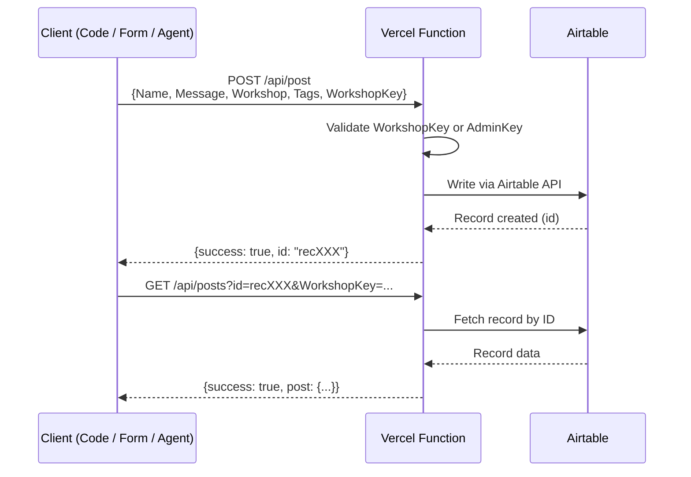

# Workshops Live Feed

A live interaction hub for my workshops. Participants post messages via code, UI forms, or AI agent tools, and see results on a shared screen in real-time. Posts are tagged to route them to the correct feed view.

**Live URL:** <https://live.segunakinyemi.com>

## What This Does

1. Participants post messages via code, a UI form, or an AI agent tool
2. Posts are tagged to route them to the correct feed view (Script Submissions, UI Submissions, or Agent Posts)
3. Posts appear on the live feed within seconds
4. I display the feed on a projector for everyone to see

## Architecture



- **Vercel** hosts the static site and serverless functions
- **Airtable** stores posts and provides the embedded gallery view
- **WorkshopKey** prevents random internet submissions

## API Endpoints

### POST `/api/post`

Creates a new post.

| Field | Type | Required | Description |
|-------|------|----------|-------------|
| `Name` | string | Yes | Participant's name |
| `Message` | string | Yes | The message content |
| `Workshop` | string | Yes | Workshop name (e.g., "AI Interview Workshop") |
| `Tags` | string | No | Comma-separated tags |
| `WorkshopKey` | string | Yes | Secret password |

**Response:** `{ success: true, message: "Posted successfully!", id: "recXXX" }`

### GET `/api/posts`

Retrieves posts for verification.

**Mode 1: Get specific post by ID**

```txt
GET /api/posts?id=recXXX&WorkshopKey=...
```

**Response:** `{ success: true, post: { id, name, message, workshop, tags, createdAt } }`

**Mode 2: List recent posts by workshop**

```txt
GET /api/posts?workshop=AI%20Interview%20Workshop&WorkshopKey=...
```

**Response:** `{ success: true, count: 12, workshop: "...", posts: [...] }`

**Mode 3: List recent posts by tag**

```txt
GET /api/posts?tag=python&WorkshopKey=...
```

**Response:** `{ success: true, count: 5, tag: "python", posts: [...] }`

## Local Development

1. Fill out an `.env` file with the required values.
2. Run `npx vercel dev`
3. Open http://localhost:3000

## Testing & CI/CD

Integration tests run automatically on every push to `main` via GitHub Actions. Tests run in Python, JavaScript, and PowerShell in parallel, creating posts, verifying they exist, then cleaning up.

See [tools/README.md](tools/README.md) for details on:

- How the CI/CD pipeline works
- Running tests manually
- Required GitHub secrets (`WORKSHOP_KEY`, `ADMIN_KEY`)
- The full test flow (POST → GET → DELETE)

## Integrating the Live Feed into a Workshop

This live feed is designed to be reused across multiple workshops. There are three integration patterns, each landing posts in a different view on the site.

### Airtable Views and How They Filter

| View | Filter Logic | Use Case |
|------|-------------|----------|
| **Script Submissions** | Posts tagged `script-submission` | Students posting via code (Python/JS/PowerShell) |
| **UI Submissions** | Posts tagged `ui-submission` | Students posting via an HTML form |
| **Agent Posts** | Posts tagged `agent-post` | AI agents posting on behalf of students |

The `Workshop` field on every post identifies which event it came from (e.g., "AI Interview Workshop", "WiDS Charlotte 2026") but is not used for view filtering.

### Pattern 1: Script Submissions

Students write code that POSTs directly to the API. Share the `WorkshopKey` verbally during the session. Posts must include `script-submission` in the Tags field to appear in the Script Submissions view.

Used in: [ai-interview-workshop](https://github.com/segunak/ai-interview-workshop) (Question 4 - students POST via Node.js)

### Pattern 2: Agent Tool Calls

An AI agent calls the live feed API as a server-side tool. The key is stored as an environment variable on the agent's hosting platform. Students never see or handle the key. Tag posts with `agent-post` so they land in the Agent Posts view.

Use the `ADMIN_KEY` (not the `WORKSHOP_KEY`) for this pattern. The admin key is permanent and doesn't rotate, which is fine since it's only used server-to-server. Set it as an env var like `LIVE_FEED_KEY` on whatever platform hosts the agent.

The `Workshop` field should be hardcoded in the tool function and changed in code per event.

Used in: [agentic-ai-workshop](https://github.com/segunak/agentic-ai-workshop) (Lab 4 - students enable a "Post to Live Feed" tool on their custom agent)

### Pattern 3: UI Form Submissions

Students fill out an HTML form that POSTs to the API. The `WorkshopKey` is baked into the form's JavaScript. Tag posts with `ui-submission` so they land in the UI Submissions view.

Used in: [ai-interview-workshop](https://github.com/segunak/ai-interview-workshop) (Question 5 - students build and use an HTML form)

### Trusted Origins

Workshop platforms like VS Code for Education and GitHub Codespaces run student code from specific domain origins. If the consuming API (not this live feed, but the API students interact with) supports a trusted origins check, you can add those domains so students skip key entry entirely. This creates a seamless experience where the platform handles auth automatically.

### Adding a New Airtable View

1. Create a new view in Airtable with the appropriate filter (by tag, workshop name, or other criteria)
2. Get the embed URL from Airtable (Share view → Embed)
3. Add a new section to `public/index.html` following the existing pattern: divider, controls section, feed section with iframe
4. The Live Mode toggle and Refresh button use shared CSS classes and will work automatically

### Authentication

| Key | Purpose | Rotation | Who sees it |
|-----|---------|----------|-------------|
| `WORKSHOP_KEY` | Student-facing auth for script and UI submissions | Rotate after each workshop | Students (shared verbally) |
| `ADMIN_KEY` | Server-to-server auth and CI/CD | Permanent | Never shared with students |

Both keys are accepted by the API. The admin key is also used by the GitHub Actions CI/CD pipeline for integration tests.
